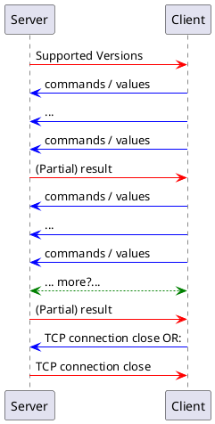
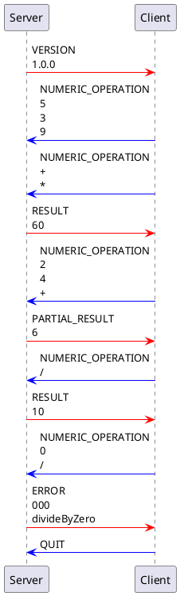

# Specification of kjorand's Network RPN Calc Protocol [NRCP]

Version 1.0.1

## Goal ( *Protocol objectives: what does the protocol do?* )

The NRCP intends to describe a protocol used for calculations with a client, where the user enters the numbers and the operations and a server, which executes them. This document specifies the format which is used to comunicate with the server (in both directions) and the frame in which it can be used.

## Protocol's Overall behavior

The NRCP operates as a RPN calculator. Unfamiliar users should look up how to interract with a RPN calculator before using such a calculator.

### Transport protocol ( *What transport protocol do we use?* )

The NRCP relies on TCP/IP for communication between the client and server.

### Connection information ( *How does the client find the server (addresses and ports)?* )

Address is out of the scope of this document. Anyone can implement a server and run it, either by accessing directly through it's IP or via DNS. 

NRCP runs on port 2600

### Opening and closing steps ( *Who speaks first?* / *Who closes the connection and when?* )

After the connection is established, the server "speaks" first. First message is the protocol version(s) that is(are) supported by the server. The client should adapt to it. Failing to do so might result in error or unexpected behavior (for instance if a new version changed behavior of a message/command ... it'll follow the one supported by the server).

The client should close the connection uppon finishing. However server might close it after a defined period of inactivity or after a connection's max duration. Server might also ask if connection is still in use before expiration of the said deadlines. The client must then respond within 5 seconds if connection should be kept open (doesn't prevent the server to close it according to the two aforementionned timeouts). [see below]

## Communication syntax ( *Messages* )

### Messages syntax ( *What is the syntax of the messages?* )
Messages follow this syntax :
```
MESSAGE TYPE
value

```
For message types accepting multiple (N) values, following syntax is used
```
MESSAGE TYPE
value0
value1
...
valueN-1

```
New lines are simply `\n` (`0x0A`). Client can however have "CRLF" line endings : `\r` (`0x0D`) are simply ignored if present. Blank line at the end is mandatory to end a message.

### Communication flow ( *What is the sequence of messages exchanged by the client and the server? (flow)* )


As one can see, client could send several commands, server will only respond when there's new computed data ready (more on that later).

### Behavior upon message reception ( *What happens when a message is received from the other party? (semantics)* )

#### On the server side
Values are pushed on the stack and operations executed immediately if applicable. Uppon execution, the computed value is returned to client.
#### On the client side
Depending on implementation, the client can display each intermediate results or drop them until final result and only display that one.

### Specific elements ( *Specific elements (if useful)* )

#### Supported operations
Current supported opeations are :
* `+` addition
* `-` substraction
* `*` multiplication
* `/` division
* `%` modulo (only defined for positive integers)
* `^` power (only defined for positive integer exponents)
* `rst` reset (completely clears the stack)
#### Message types
Message types are : 
* `VERSION` from server to client, is sent when a new client connects to the server
* `NUMERIC_OPERATION` from client to server, values can be either numbers or operations
* `PARTIAL_RESULT` from server to client, is sent when it encounters an operation followed immediately by a blank line
* `RESULT` from server to client, is sent when it encounters an operation followed immediately by a blank line and there is only one value on the stack
* `ERROR` from server to client , automatically followed by one of the following errors. First value is the error code, second is the name (as seen below), optionnal following values are description/adtionnal informations and are implementation dependant
* `ACTIVITY_PROBE` from server to client, might be sent before dropping the connection
* `ACTIVE` from client to server, as a response to the above. Might cause a `wrongSyntax` error if not sent in response to an `ACTIVITY_PROBE`
* `QUIT` from either side, indicates the connection will be closed
#### Error handling
The server can reply with following errors:
* `timeout` [010] in case of server timeout
* `divideByZero` [000] in case the user tried to divide by zero
* `wrongSyntax` [2xx] generic error in case of unrecognized syntax (unrecognized operator, or too few arguments, for example) the 2 `xx` can be any two decimal digits. Some specific values are given below.
    * `wrongMessageTypeSyntax` [20x] can be sent in any case the message type could not be identified
    * `unrecognizedOperator` [21x] can be sent in any case a character is unrecognized
    * `tooFewArguments` [22x] too few values are left on the stack

In any of the previous cases, connection is `reset` all informations transmitted by the client are wiped out and the stack is reset (as is with operation `rst`). It is the client's responsability to save user input if judged necessary and to buffer it in case the client wants to let the user cancel/erase some of its input.

#### Result presenting
As seen above, result messages come in two different forms. It is a "partial result" if there is more than 1 value left on the stack. Else it is a "result" (a.k.a final result); it stays however on the stack. NRPC protocol is indeed statefull.

#### Extensibility
Newer versions can extend the available operations but should keep backwards compatibility. Any backwards compatibility break implies a major version change. Specific implementations are also allowed to extend supported operations set.

## Examples ( *Examples: examples of some typical dialogs.* )
To ease the reading, we removed the double line feed at the end of messages

Textual example of actual exchanged message (corresponding to the above example):
```
S->C : 
VERSION
1.0.0

C->S : 
NUMERIC_OPERATION
5
3
9

C->S : 
NUMERIC_OPERATION
+
*

S->C : 
RESULT
60

C->S : 
NUMERIC_OPERATION
2
4
+

S->C : 
PARTIAL_RESULT
6

C->S : 
NUMERIC_OPERATION
/

S->C : 
RESULT
10

C->S : 
NUMERIC_OPERATION
0
/

S->C : 
ERROR
000
divideByZero

C->S : 
QUIT


```

## Version history
| Version         | Changes                                                                             |
| --------------- | ----------------------------------------------------------------------------------- |
| 0.0.0           | Initial protocol design                                                             |
| 0.0.1           | Initial review                                                                      |
| 0.0.2           | Review adding precisions (RPN calulator)                                            |
| 0.0.3           | More precise syntaxe example                                                        |
| 0.0.4           | More precise definition of (partial-)result + intro of reset (Thkx Elliot's review) |
| 1.0.0 :warning: | :red_circle: :new: SYNTAX :red_circle: + precisions added                           |
| 1.0.1           | Added quitting command                                                              |

## Version compatibility
| Version on server | Compatible from (acceptable version from client) |
| ----------------- | ------------------------------------------------ |
| 0.0.1             | 0.0.0                                            |
| 0.0.2             | 0.0.0                                            |
| 0.0.3             | 0.0.0                                            |
| 0.0.4             | 0.0.0 :x:                                        |
| 1.0.0             | 1.0.0 :new:                                      |
| 1.0.1             | 1.0.0                                            |
