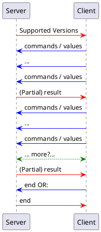
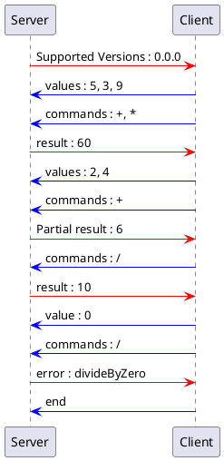

# Specification of kjorand's Network RPN Calc Protocol [NRCP]

Version 0.0.4 

## Goal ( *Protocol objectives: what does the protocol do?* )

The NRCP intends to describe a protocol used for calculations with a client, where the user enters the numbers and the operations and a server, which executes them. This document specifies the format which is used to comunicate with the server (in both directions) and the frame in which it can be used.

## Protocol's Overall behavior

The NRCP operates as a RPN calculator. Unfamiliar users should look up how to interract with a RPN calculator before using such a calculator.

### Transport protocol ( *What transport protocol do we use?* )

The NRCP relies on TCP/IP for communication between the client and server.

### Connection information ( *How does the client find the server (addresses and ports)?* )

Address is out of the scope of this document. Anyone can implement a server and run it, either by accessing directly through it's IP or via DNS. 

NRCP runs on port 2600

### Opening and closing steps ( *Who speaks first?* / *Who closes the connection and when?* )

After the connection is established, the server "speaks" first. First message is the protocol version(s) that is(are) supported by the server. The client should adapt to it. Failing to do so might result in error or unexpected behavior (for instance if a new version changed behavior of a message/command ... it'll follow the one supported by the server).

The client should close the connection uppon finishing. However server might close it after a defined period of inactivity or after a connection's max duration. Server might also ask if connection is still in use before expiration of the said deadlines. The client must then respond within 5 seconds if connection should be kept open (doesn't prevent the server to close it according to the two aforementionned timeouts). [see below]

## Communication syntax ( *Messages* )

### Messages syntax ( *What is the syntax of the messages?* )
Messages follow this syntax :
```
{control}value{-}
```
For message types accepting multiple (N) values, following syntax is used
```
{control}[value0],[value1],...,[valueN-1]{-}
```

### Communication flow ( *What is the sequence of messages exchanged by the client and the server? (flow)* )


### Behavior upon message reception ( *What happens when a message is received from the other party? (semantics)* )

#### On the server side
Values and commands are added to the stack and executed if applicable. Uppon execution, the computed value is returned to client.
#### On the client side
Dependind on implementation, the client can display each intermediate results or drop them until final result

### Specific elements ( *Specific elements (if useful)* )

#### Supported operations
Current supported opeations are :
* `+` addition
* `-` substraction
* `*` multiplication
* `/` division
* `%` modulo (only defined for positive integers)
* `^` power (only defined for positive integer exponents)
* `rst` reset (completely clears the stack)
#### Error handling
The server can reply with following errors:
* `timeout` in case of server timeout
* `divideByZero` in case the user tried to divide by zero
* `wrongSyntax` in case of unrecognized syntax (unrecognized operator, or too many/few arguments, for example)

In any of the previous cases, connection is `reset` all informations transmitted by the client are wiped out and the stack is reset. It is the client's responsability to save user input if judged necessary and to buffer it in case the client wants to let the user cancel/erase some of its input.

#### Result presenting
After each command set (set of operations), the server returns a result. It is a "partial result" if there is more than 1 value left on the stack. Else it is a "result" (a.k.a final result); it stays however on the stack if needed

#### Extensibility
Newer versions can extend the available operations but should keep backwards compatibility. Any backwards compatibility break implies a major version change.

## Examples ( *Examples: examples of some typical dialogs.* )
To ease the reading, we removed the markups

Examples of actual exchanged message (corresponding to the above example):
```
Server -> Client : {Supported Version}0.0.0{-}
Client -> Server : {values}[5],[3],[9]{-}
Client -> Server : {operations}[+],[*]{-}
Server -> Client : {result}60{-}
Client -> Server : {values}[2],[4]{-}
Client -> Server : {commands}+{-}
Server -> Client : {Partial result}6{-}
Client -> Server : {commands}/{-}
Server -> Client : {result}10{-}
Client -> Server : {value}0{-}
Client -> Server : {commands}/{-}
Server -> Client : {error}divideByZero{-}
Client -> Server : {end}{-}
```

## Version history
| Version | Changes                                                                             |
| ------- | ----------------------------------------------------------------------------------- |
| 0.0.0   | Initial protocol design                                                             |
| 0.0.1   | Initial review                                                                      |
| 0.0.2   | Review adding precisions (RPN calulator)                                            |
| 0.0.3   | More precise syntaxe example                                                        |
| 0.0.4   | More precise definition of (partial-)result + intro of reset (Thkx Elliot's review) |

## Version compatibility
| Version on server | Compatible from (acceptable version from client) |
| ----------------- | ------------------------------------------------ |
| 0.0.1             | 0.0.0                                            |
| 0.0.2             | 0.0.0                                            |
| 0.0.3             | 0.0.0                                            |
| 0.0.4             | 0.0.0                                            |
